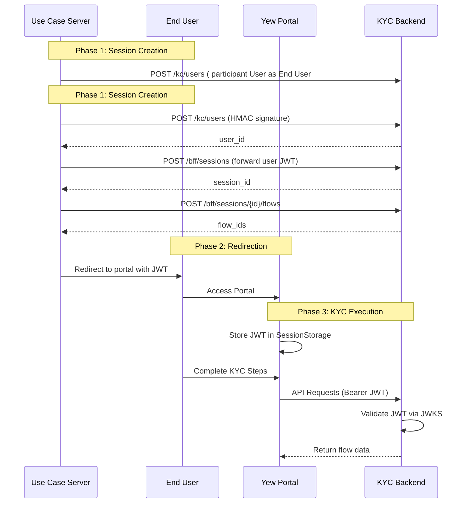

# Veriffyi - KYC Hosted Page Portal

> A modern, high-performance KYC (Know Your Customer) portal built with Rust Yew WASM, designed to deliver seamless identity verification experiences.

## Overview

Veriffyi is a **KYC Hosted Page Portal** that provides a user-facing, high-conversion experience for end-users to complete their identity verification processes. Built entirely in Rust and compiled to WebAssembly (WASM), it delivers exceptional performance while maintaining type safety and memory safety guarantees.

The portal acts as a driver for the backend's state machine, rendering the current KYC step provided by the BFF API and capturing user input to transition the flow state. It supports multiple KYC flows including phone OTP verification, document uploads, and identity confirmation processes.

## Architecture

Veriffyi follows a decoupled SPA architecture where the frontend communicates with a backend BFF (Backend for Frontend) API surface. The system is designed to work with external OIDC providers for authentication.

### High-Level Component Architecture

```mermaid
graph TD
    subgraph "Client Side (WASM)"
        UI[UI Components Layer - Yew]
        Engine[Flow Orchestration Engine]
        Store[State Management - Rust/Yew]
        Auth[Auth Handler - JWT Manager]
    end

    subgraph "Backend (KYC Services)"
        BFF[BFF API - /bff/*]
        AuthAPI[Auth API - /auth/*]
        FlowSDK[Flow SDK Engine]
        DB[(PostgreSQL)]
    end

    subgraph "External Services"
        UC[Use Case Server]
        S3[MinIO/S3 - File Storage]
        SMS[SMS/Email Provider]
    end

    UC -->|1. Create session via /bff/sessions| BFF
    UC -->|2. Add flows via /bff/sessions/{id}/flows| BFF
    UC -->|3. Redirect with JWT| UI
    UI -->|4. Authenticated API Calls (Bearer JWT)| BFF
    BFF --> FlowSDK
    FlowSDK --> DB
    BFF --> S3
    FlowSDK --> SMS
```

For detailed architecture documentation, see [KYC Portal Architecture](docs/kyc-portal-architecture.md).

### Authentication Sequence

The authentication flow works as follows:

1. **Session Creation** (Server-to-Server): The Use Case Server creates a session and adds KYC flows via the BFF API
2. **Redirection**: User is redirected to the Veriffyi portal with a JWT token
3. **JWT Storage**: The portal extracts and stores the JWT in SessionStorage
4. **API Requests**: All subsequent BFF requests include the JWT as a Bearer token



## Technology Stack

| Category             | Technology                    | Purpose                                               |
| -------------------- | ----------------------------- | ----------------------------------------------------- |
| **Framework**        | Rust Yew                      | WASM-based SPA for high performance and memory safety |
| **State Management** | Rust-based state pattern      | Predictable state transitions via Yew's architecture  |
| **UI Library**       | Yew Components + Tailwind CSS | High customization and responsive design              |
| **Build Tooling**    | Trunk                         | Standard build tool for Yew/WASM applications         |
| **Testing**          | wasm-bindgen-test             | Native WASM testing capabilities                      |
| **HTTP Client**      | gloo-net / reqwest-wasm       | API communication                                     |
| **Styling**          | Tailwind CSS (via postcss)    | Utility-first CSS framework                           |

## Prerequisites

Before getting started, ensure you have the following installed:

- **Rust** (latest stable) - [Install Rust](https://rustup.rs/)
- **wasm32-unknown-unknown** target - `rustup target add wasm32-unknown-unknown`
- **Trunk CLI** - `cargo install trunk`
- **Node.js & npm** (for Tailwind CSS processing)
- **Tailwind CSS** - `npm install`

### Quick Setup

```bash
# Install Rust WASM target
rustup target add wasm32-unknown-unknown

# Install Trunk CLI
cargo install trunk

# Install npm dependencies for Tailwind
npm install
```

## Getting Started

### 1. Development Server

Start the local development server with hot reload:

```bash
trunk serve
```

This will:

- Build the WASM application
- Process Tailwind CSS
- Serve on `http://localhost:8080` (default)
- Watch for file changes

### 2. Production Build

Create an optimized production build:

```bash
trunk build --release
```

The output will be placed in the `dist/` directory, ready for static hosting.

## Project Structure

```
veriffyi/
├── src/
│   ├── main.rs              # WASM entry point
│   ├── lib.rs               # Library exports
│   ├── auth/                # Authentication module
│   │   ├── mod.rs           # JWT extraction and validation
│   │   └── client.rs        # Auth client implementation
│   ├── state/               # State management
│   │   ├── mod.rs           # Global state definitions
│   │   └── flow.rs          # KYC flow state machine
│   ├── api/                 # BFF API client
│   │   ├── mod.rs           # API client configuration
│   │   ├── bff.rs           # BFF endpoint implementations
│   │   └── models.rs        # Request/Response type definitions
│   ├── components/          # Reusable UI components
│   │   ├── mod.rs           # Component exports
│   │   ├── layout.rs        # Page layout components
│   │   ├── flow.rs          # KYC flow rendering components
│   │   └── ui.rs            # Base UI primitives
│   └── utils/               # Utility functions
│       └── mod.rs           # Helpers and shared logic
├── tests/
│   └── wasm_tests.rs        # WASM-native test suite
├── docs/
│   ├── kyc-portal-architecture.md    # Architecture documentation
│   └── openapi/
│       └── user-storage-bff.yaml     # BFF API specification
├── Trunk.toml               # Trunk build configuration
├── tailwind.config.js       # Tailwind CSS configuration
├── postcss.config.js        # PostCSS processing config
├── index.html               # HTML entry point
└── Cargo.toml               # Rust package manifest
```

### Key Directories

#### `src/auth/` - JWT Authentication

Handles extraction of JWT tokens from URL fragments/query parameters and manages SessionStorage persistence. Implements the `AuthClient` trait for authenticated API requests.

#### `src/state/` - State Management

Centralized state management using Yew's built-in state patterns. Contains the KYC flow state machine logic and session state.

#### `src/api/` - BFF API Client

Implements the BFF API client with type-safe request/response handling. All API calls include automatic JWT bearer token injection.

#### `src/components/` - UI Components

Reusable Yew components for rendering KYC flows, forms, and UI elements. Organized by concern (layout, flow steps, base UI).

#### `src/utils/` - Utilities

Shared utility functions for formatting, validation, and common operations.

## Authentication Flow

Veriffyi handles authentication in a unique way optimized for hosted KYC flows:

### JWT Extraction

On initial load, the portal extracts the JWT from either:

- URL fragment: `#token=<jwt>`
- Query parameter: `?token=<jwt>`

### SessionStorage

The extracted JWT is stored in `web_sys::Window::session_storage()` for the duration of the browser session.

### Injected Auth

All BFF API requests automatically include the `Authorization: Bearer <JWT>` header via a custom `Request` wrapper.

```rust
// Example: Authenticated API call
let client = BffClient::new();
let response = client.get_flow_session(session_id).await?;
```

## BFF API Integration

The portal communicates with the backend via the BFF API surface (`/bff/*`). The OpenAPI specification is available at [`docs/openapi/user-storage-bff.yaml`](docs/openapi/user-storage-bff.yaml).

### Key Endpoints

| Endpoint              | Method | Description                           |
| --------------------- | ------ | ------------------------------------- |
| `/flow/sessions`      | GET    | List all flow sessions for the caller |
| `/flow/sessions`      | POST   | Create a new flow session             |
| `/flow/sessions/{id}` | GET    | Get session details with nested flows |
| `/flow/flows/{id}`    | GET    | Get flow with its steps               |
| `/flow/steps/{id}`    | GET    | Get step details                      |
| `/flow/steps/{id}`    | POST   | Submit user input for a waiting step  |
| `/uploads/presign`    | POST   | Create presigned upload URL           |
| `/uploads/complete`   | POST   | Complete upload registration          |

### API Client Usage

```rust
use crate::api::bff::BffClient;

let client = BffClient::default();

// Get session details
let session = client.get_flow_session("session_123").await?;

// Submit a step
let result = client.submit_flow_step("step_456", input).await?;
```

## Development

### Running Locally

```bash
# Start development server
trunk serve

# Or with custom port
trunk serve --port 3000
```

### Testing

Run WASM-native tests:

```bash
# Run all tests
wasm-pack test --headless --firefox
wasm-pack test --headless --chrome

# Run specific test module
cargo test -p veriffyi --target wasm32-unknown-unknown
```

### Code Quality

```bash
# Format code
cargo fmt

# Run clippy
cargo clippy --target wasm32-unknown-unknown -- -D warnings

# Check compilation
cargo check --target wasm32-unknown-unknown
```

## Deployment

### Production Build

```bash
# Create optimized build
trunk build --release

# Output is in dist/ directory
ls dist/
# ├── index.html
# ├── veriffyi-<hash>.wasm
# └── veriffyi-<hash>.css
```

### Static Hosting

The `dist/` directory contains all files needed for static hosting:

1. Upload `dist/` contents to your static host (S3, Cloudflare Pages, Netlify, etc.)
2. Configure the host to serve `index.html` for all routes (SPA fallback)
3. Ensure CORS is configured for the BFF API domain

### Docker Deployment (Optional)

```dockerfile
FROM rust:latest as builder
WORKDIR /app
COPY . .
RUN cargo install trunk
RUN trunk build --release

FROM nginx:alpine
COPY --from=builder /app/dist /usr/share/nginx/html
COPY nginx.conf /etc/nginx/nginx.conf
EXPOSE 80
```

## Configuration

### Trunk.toml

```toml
[build]
target = "index.html"
dist = "dist"

[serve]
port = 8080
open = false

[[proxy]]
backend = "http://localhost:3000/bff"
```

### Environment Variables

The BFF API endpoint can be configured via:

- `Trunk.toml` proxy settings (development)
- Build-time environment variables (production)
- Runtime configuration in `src/api/mod.rs`

## Troubleshooting

### WASM Build Fails

- Ensure `wasm32-unknown-unknown` target is installed: `rustup target add wasm32-unknown-unknown`
- Check Rust version: `rustc --version` (1.70+ recommended)

### Tailwind Not Processing

- Verify `npm install` was run
- Check `postcss.config.js` and `tailwind.config.js` are present
- Run `npx tailwindcss build` manually to debug

### Authentication Errors

- Verify JWT is being passed in URL fragment or query parameter
- Check SessionStorage is available (not blocked by browser settings)
- Ensure BFF API CORS allows the origin

## Contributing

1. Fork the repository
2. Create your feature branch (`git checkout -b feature/amazing-feature`)
3. Commit your changes (`git commit -m 'feat: add amazing feature'`)
4. Push to the branch (`git push origin feature/amazing-feature`)
5. Open a Pull Request

## License

This project is licensed under the MIT License - see the [LICENSE](LICENSE) file for details.

## Acknowledgments

- [Yew Framework](https://yew.rs/) - Rust WASM framework
- [Trunk](https://trunkrs.dev/) - WASM build tool
- [Tailwind CSS](https://tailwindcss.com/) - Utility-first CSS framework
