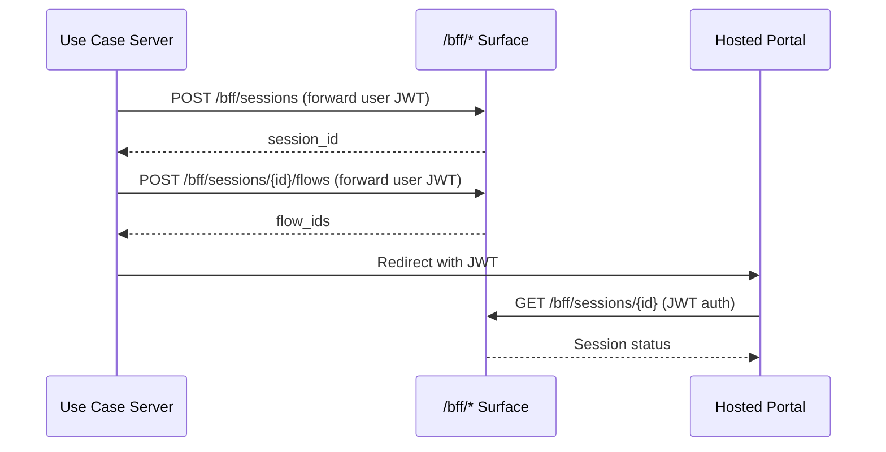
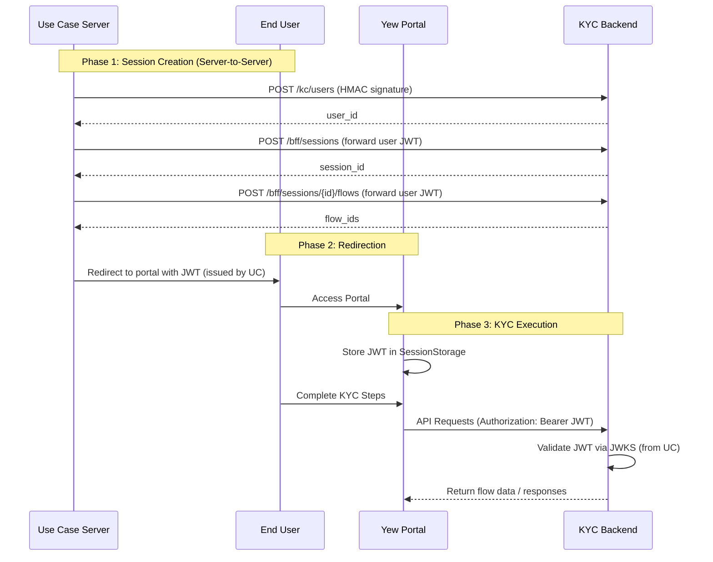

# KYC Hosted Page Portal Architecture

## Why?
The KYC Hosted Page Portal provides a user-facing, high-conversion experience for end-users to complete their identity verification (KYC) flows. It must handle complex, state-driven processes (like document uploads and OTP) while remaining extremely responsive and accessible on mobile devices.

## Actual
The portal is a decoupled Single Page Application (SPA) built with **Rust Yew (WASM)**. It acts as a driver for the backend's state machine, focusing on rendering the current step provided by the BFF API and capturing user input to transition the state.

## Constraints
- **WASM environment**: Must handle session management within the constraints of WebAssembly.
- **Resource Server Pattern**: The backend acts as an OAuth2/OIDC Resource Server, delegating authentication to an external Identity Provider (IdP).

## Findings
The backend is capable of acting as a Resource Server for any OIDC provider. By configuring the `oauth2.issuer` to point to the Use Case Server's OIDC endpoint, the KYC backend can validate JWTs issued by the Use Case Server via JWKS.

## Architecture Diagram

### High-Level Component Architecture
```mermaid
graph TD
    subgraph "Client Side (WASM)"
        UI[UI Components Layer - Yew]
        Engine[Flow Orchestration Engine]
        Store[State Management - Rust/Yew]
        Auth[Auth Handler - JWT Manager]
    end

    subgraph "Backend (KYC Services)"
        BFF[BFF API - /bff/*]
        AuthAPI[Auth API - /auth/*]
        FlowSDK[Flow SDK Engine]
        DB[(PostgreSQL)]
    end

    subgraph "External Services"
        UC[Use Case Server]
        S3[MinIO/S3 - File Storage]
        SMS[SMS/Email Provider]
    end

    UC -->|1. Create session via /bff/sessions| BFF
    UC -->|2. Add flows via /bff/sessions/{id}/flows| BFF
    UC -->|3. Redirect with JWT| UI
    UI -->|4. Authenticated API Calls (Bearer JWT)| BFF
    BFF --> FlowSDK
    FlowSDK --> DB
    BFF --> S3
    FlowSDK --> SMS
```

### Flow Initiation Sequence


### Authentication Sequence


## How to?

### Technology Stack
| Category | Recommendation | Justification |
|----------|----------------|---------------|
| **Framework** | **Rust Yew** | WASM-based SPA for high performance and memory safety. |
| **State Management** | **Rust-based state pattern** | Leveraging Yew's architecture for predictable state transitions. |
| **UI Library** | **Yew Components + Tailwind CSS** | High customization and performance. |
| **Build Tooling** | **Trunk** | Standard build tool for Yew/WASM. |
| **Testing Strategy** | **wasm-bindgen-test** | Native WASM testing capabilities. |

### Authentication Implementation
1. **Extraction**: Use `web_sys` to parse the JWT from the URL fragment or query parameters on startup.
2. **Storage**: Store the resulting `JWT` in `web_sys::Window::session_storage()`.
3. **Injected Auth**: Implement a custom `Request` wrapper that automatically attaches the `Authorization: Bearer <JWT>` header to all BFF requests.

### File Upload Strategy
1. **Capture**: Use browser APIs via Yew to capture document files.
2. **Upload**: Send files to `BFF /bff_uploads`.
3. **Submit**: Include the resulting object key in subsequent state transitions.

## Configuration & Deployment

To integrate with an external OIDC provider (like a Use Case Server), configure the `oauth2` section in the backend configuration:

```yaml
oauth2:
  issuer: "https://use-case-server.example.com/"
  jwks-uri: "https://use-case-server.example.com/.well-known/jwks.json"
  base-paths:
    - "/bff"
```

## Conclusion
The simplified architecture leverages the backend's existing capability as a Resource Server. By delegating identity to the Use Case Server, we remove the complexity of internal token exchange and self-signed JWT issuance, resulting in a more robust and standard-compliant system.
